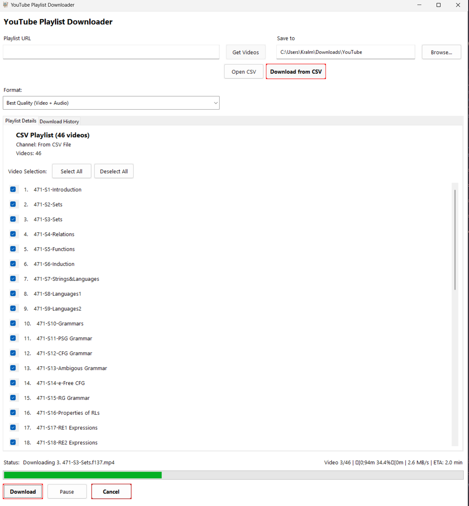

  

# PlaylistGrab

**Your playlists, your device, your time.**

Save entire YouTube playlists to watch offline. No ads, no buffering, no internet needed.

## What Does It Do?

PlaylistGrab downloads YouTube videos and playlists directly to your computer. Perfect for long flights, road trips, or anywhere without reliable internet. You pick the quality, choose where to save them, and watch whenever you want.

Think of it like recording your favorite TV shows, but for YouTube playlists.

  

## Getting Started

### The Easy Way

**Windows:** Just double-click `run.bat` and you're done.

**Linux/Mac:** Open a terminal in this folder and run `./run.sh` (you might need to run `chmod +x run.sh` first to make it executable).

The first time takes a minute to set everything up, then the app opens automatically.

That's it. Seriously.

### What You Need

- Windows (7, 10, or 11), Linux, or Mac computer
- Internet connection (just for downloading, obviously)
- About 100MB of free space for the app itself

The app will work fine on pretty much any computer from the last decade.

## How to Use It

### Downloading from a YouTube Playlist

1. Open YouTube and find a playlist you want to download
2. Copy the playlist URL from your browser's address bar
3. Paste it into the "Playlist URL" box in PlaylistGrab
4. Click "Get Videos" and wait a few seconds
5. You'll see all the videos in the playlist with thumbnails
6. Pick which ones you want (or leave them all selected)
7. Choose your video quality from the dropdown menu
   - Pick "Best Quality" if you have space and want the sharpest video
   - Pick "HD 720p" for a good balance
   - Pick "360p" if you're tight on storage
   - Pick "Audio Only" if you just want the sound
8. Click "Browse" if you want to change where files are saved
9. Hit the big "Download" button
10. Go make some coffee. The app will show you the progress

### Downloading from Your Own List

Sometimes you want to download specific videos, not a whole playlist. Here's how:

1. Click "Open CSV" button
2. A spreadsheet file opens up (don't worry, it's simple)
3. Type the video title in the first column, paste the video URL in the second
4. Add as many videos as you want, one per row
5. Save and close the file
6. Back in PlaylistGrab, click "Download from CSV"
7. Select which videos you want
8. Click "Download"

The videos will be numbered in the order you listed them, which is handy for making your own playlists.

### During the Download

- The progress bar shows how far along you are
- You can pause and resume if you need to do something else
- Click "Cancel" if you change your mind
- The app shows download speed and how much time is left
- You can use your computer normally while it downloads

### After Downloading

Your videos are saved in the folder you chose (default is your Downloads folder in a "YouTube" subfolder). Just open that folder and double-click any video to watch it.

The app also keeps a history of what you've downloaded, so you can check the "Download History" tab to see your past downloads.

## Common Questions

**How much does it cost?**  
Nothing. It's completely free.

**Do I need to keep opening the app?**  
No, just run `run.bat` (Windows) or `./run.sh` (Linux/Mac) each time. It remembers everything.

**Can I download just one video?**  
Yes. Either paste a single video URL instead of a playlist, or use the CSV method to list just one video.

**What if my antivirus flags it?**  
This happens sometimes with download apps. The app is safe - you can check the code yourself since it's open source. Just tell your antivirus to allow it.

**Will this work on Mac or Linux?**  
Yes! Use the `run.sh` script. Open a terminal, navigate to the folder, and run `./run.sh`

**Can I pick specific videos from a playlist?**  
Yes. After clicking "Get Videos", just uncheck the ones you don't want before downloading.

**What video quality should I choose?**  
If you're watching on a TV or big monitor, go with Best Quality or HD 1080p. For phones or tablets, HD 720p is plenty. If storage is tight, 480p or 360p still looks decent on smaller screens.

**How long does it take?**  
Depends on your internet speed and video size. A 10-minute HD video usually takes 2-5 minutes to download.

**Where do the files go?**  
By default: `C:\Users\YourName\Downloads\YouTube\`  
You can change this by clicking the Browse button.

## Legal Stuff

This app is for personal use. Don't download videos you don't have permission to download. Respect creators' rights and YouTube's rules. If you're downloading someone else's content, make sure you're allowed to.

Use common sense and be decent.

## Support

Having trouble? Found a bug? Open an issue on GitHub and describe what's happening. Include what you were trying to do and any error messages you saw.

## Credits

Built with yt-dlp and FFmpeg. Thanks to everyone who contributes to those projects.