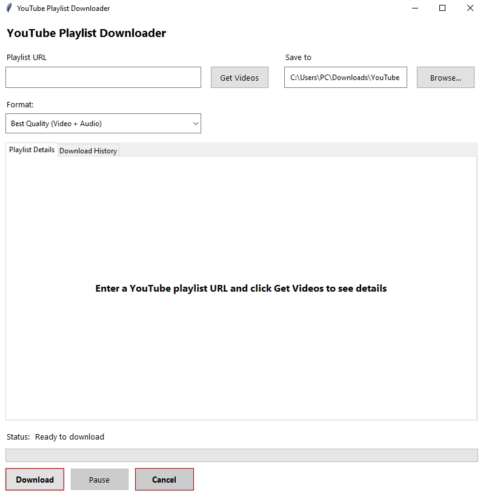

<p align="center">
  
</p>

# YouTube Playlist Downloader

[](https://opensource.org/licenses/MIT) [](https://www.python.org/downloads/) [](https://github.com/yt-dlp/yt-dlp)

A powerful, user-friendly desktop application for downloading YouTube playlists with advanced features for customization and control.

## Screenshot

<p align="center">
  
</p>

## Installation for Users

### Windows

1. Download the latest release from the [Releases page](https://github.com/barandev/youtube-playlist-downloader/releases)
2. Run the installer or extract the portable version
3. Launch `YouTube Playlist Downloader.exe`

### From Source

1. Clone this repository:
   ```bash
   git clone https://github.com/barandev/youtube-playlist-downloader.git
   cd youtube-playlist-downloader
2. Install dependencies:
   ```bash
   pip install -r requirements.txt
   ```
3. Run the application:
   ```bash
   python main.py
   ```

## Requirements

- Python 3.6 or higher
- yt-dlp
- FFmpeg (for video/audio processing)
- Tkinter (included with most Python installations)

## Usage

1. **Enter a YouTube playlist URL** in the input field
2. **Click "Get Videos"** to preview the playlist contents
3. **Select which videos** you want to download (all are selected by default)
4. **Choose your preferred quality** from the dropdown menu
5. **Set the output directory** where files will be saved
6. **Click "Download"** to start the download process
7. Use the **pause/resume and cancel buttons** to control active downloads
8. Track download **progress, speed, and estimated time** in real-time
9. Access **download history** to re-download previous playlists

## Development

### Requirements
- Python 3.6+
- pip

### Setup Development Environment
```bash
# Clone the repository
git clone https://github.com/barandev/youtube-playlist-downloader.git
cd youtube-playlist-downloader
```

# Create a virtual environment
```bash
python -m venv venv
source venv/bin/activate  # On Windows: venv\Scripts\activate
```
# Install dependencies
```bash
pip install -r requirements.txt
```


### Build Executable
```bash
# Install PyInstaller
pip install pyinstaller

# Build the executable
pyinstaller --onefile --windowed --icon=docs/images/icon.ico main.py
```

# Security Information: False Positive Detection

Some antivirus software may flag YouTube Playlist Downloader as suspicious or potentially unwanted. This is a **false positive** detection that commonly affects YouTube downloading applications and other utilities that convert Python code to executable files.

## VirusTotal Scan Results

I've scanned our application with VirusTotal, and you can view the results here:
[VirusTotal Scan Results](https://www.virustotal.com/gui/file/17cc64e742c228b1204128cef409d3aebe4f9f341161a4a6fdad2e788e8a4c2d/detection)

## Why This Happens

1. **PyInstaller Packaging**: Converting Python code to an executable creates patterns that some antivirus heuristics flag as suspicious
2. **Video Downloading Functionality**: Applications that download content from websites are often categorized similarly to potentially unwanted programs
3. **File System Operations**: Our app creates folders and writes files, actions that security software monitors closely
4. **External Libraries**: We use `yt-dlp` which is sometimes flagged due to its video downloading capabilities

## How To Use If Your Antivirus Blocks It

1. **Add an Exception**: Add the application to your antivirus whitelist/exceptions list
2. **Build from Source**: Follow the instructions in this README to build the application yourself
3. **Use Portable Version**: Try the portable version which may trigger fewer detections
4. **Report False Positive**: Consider reporting this as a false positive to your antivirus provider

## Contributing

Contributions are welcome! Please feel free to submit a Pull Request.

1. Fork the repository
2. Create your feature branch (`git checkout -b feature/amazing-feature`)
3. Commit your changes (`git commit -m 'Add some amazing feature'`)
4. Push to the branch (`git push origin feature/amazing-feature`)
5. Open a Pull Request

## License

This project is licensed under the MIT License - see the [LICENSE](LICENSE) file for details.

## Acknowledgments

- [yt-dlp](https://github.com/yt-dlp/yt-dlp) for the powerful YouTube downloading capabilities
- [FFmpeg](https://ffmpeg.org/) for video and audio processing
- [Tkinter](https://docs.python.org/3/library/tkinter.html) for the GUI framework

## Disclaimer

This tool is for personal use only. Please respect **YouTube's Terms of Service** and **copyright laws** when downloading content.
